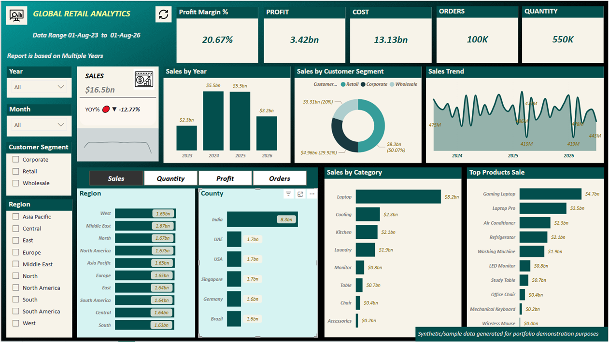
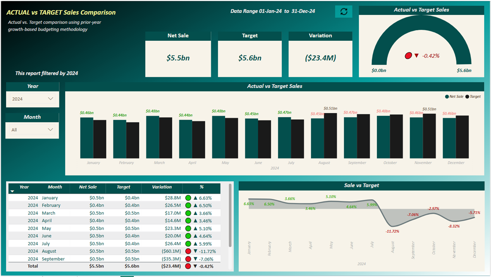

# GlobalRetailAnalytics — End-to-End Retail BI Dashboard

An end-to-end Business Intelligence solution simulating a multi-region retail business, built on **SQL Server** (data source) and **Power BI** (reporting layer).

> **Note:** This project uses synthetic/sample data generated for portfolio demonstration purposes. It is not based on real company or client data.

---

## 📊 Dashboard Pages

### 1. Single View — Executive Summary


KPI overview (Profit Margin%, Profit, Cost, Orders, Quantity), sales trend, regional and category breakdown, top products, and customer segment analysis — with Year/Month/Segment/Region filtering.

### 2. Actual vs Target — Variance Analysis


Monthly Actual vs. Target comparison with conditional formatting (red/green variance indicators), a variance-band trend chart, and a detailed month-by-month breakdown table.

---

## 🧱 Data Model

Built as a corrected star schema:

- **Fact tables:** `FactSales`, `FactBudget_Target`
- **Dimension tables:** `DimDate`, `DimProduct`, `DimStore`, `DimRegion`, `DimSupplier`, `DimCustomer`, `DimEmployee`, `DimPromotion`
- **Bridge table:** A custom month-grain bridge table relates the monthly-grain `FactBudget_Target` table to the daily-grain `DimDate` table — avoiding the common pitfall of relating fact tables at mismatched grains directly.

**Key modeling decisions:**
- Original model had `DimRegion` and `DimSupplier` sitting unlinked to the fact table — corrected by properly relating them through `DimStore` and `DimProduct` respectively.
- Used a **month-grain bridge table** (rather than a direct daily-to-monthly relationship) to cleanly join `FactBudget_Target` to the model without breaking day-level slicing on `FactSales`.

---

## 🧮 DAX Highlights

- **Time intelligence:** YTD, MTD, YoY measures using standard DAX time-intelligence functions
- **Partial-month handling:** Current/incomplete month is excluded or clearly flagged (MTD) in trend visuals, rather than shown as a misleading full-period value
- **Actual vs Target:**
  ```dax
  Total Actual Sales = SUM(FactSales[Amount])
  Total Target = SUM(FactBudget_Target[TargetSales])
  Variance = [Total Actual Sales] - [Total Target]
  Variance % = DIVIDE([Variance], [Total Target], 0)
  ```
- **Row-Level Security (RLS):** Implemented region-based access control so different stakeholders see only their relevant data slice.

---

## 🎯 Target Methodology

Monthly targets were generated using a standard **prior-year + growth assumption** budgeting approach:

```
Target(Month X, Year Y) = Actual(Month X, Year Y-1) × (1 + Growth%)
```

This mirrors how many organizations set baseline budgets in practice. Where prior-year data wasn't available (the earliest months in the dataset), targets were estimated separately and flagged accordingly.

---

## ⚙️ ETL & Refresh

- Source data extracted and transformed via **T-SQL** (SQL Server) and **Power Query**
- **Incremental refresh** configured in Power BI against the SQL Server source, with query folding verified via "View Native Query" to confirm date-range filters are pushed down to the source rather than processed client-side

---

## 🛠️ Tools & Skills

`SQL Server` `T-SQL` `Power BI` `DAX` `Power Query` `Data Modeling` `Star Schema` `Row-Level Security` `Time Intelligence`

---

## 📁 Files in this Repo

- `GlobalRetailAnalytics.pbix` — the full Power BI file
- `screenshot_1_single_view.png` — Executive summary page
- `screenshot_2_actual_vs_target.png` — Actual vs Target variance page

---

## 👤 About

Built by Balram — BI & Analytics professional with 12+ years of experience in reporting, SQL-based analysis, and dashboard development, currently expanding into cloud-based analytics (Azure).

[LinkedIn](https://linkedin.com/in/balram-prajapati-473094b9)
